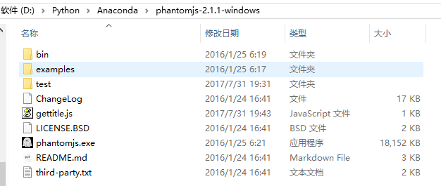
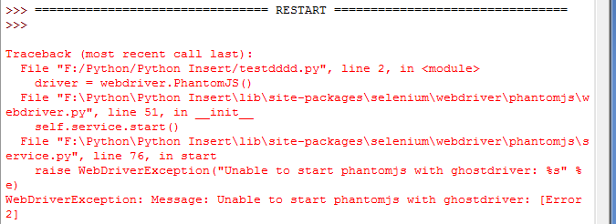
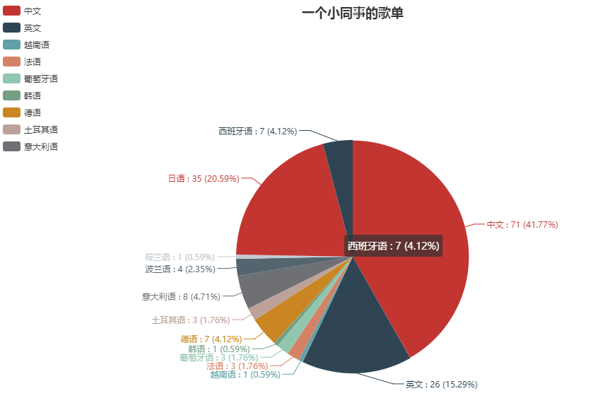

# zxylina-网易云音乐爬取分析

*Windows10 企业版*

*Python 2.7*

*selenium 3.4.3*

*phantomjs-2.1.1-windows*

## 搭建爬虫环境

### 1.安装selenuim

```
pip install selenium
```

### 2.安装phantomjs

```
官网http://phantomjs.org/下载PhantomJS解压后如下图所示：
```



测试安装是否成功：

```
# 进入python环境后执行如下操作

# win下操作
>>> from selenium import webdriver  # pip install selenium
>>> driver_detail = webdriver.PhantomJS(executable_path="D:\Python\Anaconda\phantomjs-2.1.1-windows\phantomjs.exe")
>>> driver_detail.get('https://www.baidu.com')
>>> news = driver_detail.find_element_by_xpath("//div[@id='u1']/a")
>>> print news.text
```

会报错： 

按照错误信息里的路径（本截图非当时报错信息）：

1、修改或者注释相应py文件的line 76行即可；

2、需要配置phantomjs的真实路径，压缩完phantomjs.exe在bin目录下，如有报错可以复制到上一层目录；建议测试使用jypyter notebook。

参考：在Windows下安装PIP+Phantomjs+Selenium：http://blog.csdn.net/eastmount/article/details/47785123

## 爬取动态数据

本人没有网易云音乐号，同事那里借了个号（骗他登录偷偷记下id）

http://music.163.com/user/home?id=305514369

## SHOW数据-ROUND1

```
# -*- coding: utf-8 -*-
# Author:哈士奇说喵（可爱的课代表）
# Create:20170707

import traceback
from selenium import webdriver
import selenium.webdriver.support.ui as ui
from selenium.webdriver.common.desired_capabilities import DesiredCapabilities
import time
import random

# 存储为文本的子函数
def write2txt(data,path):
    f = open(path,"a")
    f.write(data)
    f.write("\n")
    f.close()

# 获取该id喜欢音乐的列表
def catchSongs(url_id,url):

    user = url_id.split('=')[-1].strip()  
    print 'excute user:',user

    driver = webdriver.PhantomJS(executable_path="D:\Python\Anaconda\phantomjs-2.1.1-windows\phantomjs.exe")# 注意填上路径
    driver.get(url)

    driver.switch_to_frame('g_iframe')  # 网易云的音乐元素都放在框架内！！！！先切换框架

    try:
        wait = ui.WebDriverWait(driver,15)
        wait.until(lambda driver: driver.find_element_by_xpath('//*[@class="j-flag"]/table/tbody'))  # 等待元素渲染出来
        try:
            song_key = 1
            wrong_time = 0
            while wrong_time < 5:  # 不断获取歌信息，假定5次获取不到值，就判无值可获取，跳出循环
                try:
                    songs = driver.find_elements_by_xpath('//*[@class="j-flag"]/table/tbody/tr[%s]'%song_key)
                    info_ = songs[0].text.strip().split("\n")
                    if len(info_) == 5:
                        info_.insert(2,'None') # 没有MV选项的进行插入None
                    new_line = '%s|'%user+'|'.join(info_)
                    song_key +=1
                    #new_line = "%s|%s|%s|%s|%s|%s|%s"%(user,info_[0],info_[1],info_[2],info_[3],info_[4],info_[5])

                    print new_line

                    write2txt(new_line.encode('utf-8'),user)  # mac写入文件需要改变字符，以id命名的文件，存储在执行脚本的当前路径下，在win下请去掉编.endcode('utf-8')
                except Exception as ex:
                    wrong_time +=1
                    # print ex
        except Exception as ex:
            pass
    except Exception as ex:
        traceback.print_exc()
    finally:
        driver.quit()

# 获取id所喜爱的音乐的url
def catchPlaylist(url):
    driver = webdriver.PhantomJS(executable_path="D:\Python\Anaconda\phantomjs-2.1.1-windows\phantomjs.exe") # 注意填上路径
    driver.get(url)

    driver.switch_to_frame('g_iframe')  # 网易云的音乐元素都放在框架内！！！！先切换框架

    try:
        wait = ui.WebDriverWait(driver,15)
        wait.until(lambda driver: driver.find_element_by_xpath('//*[@class="m-cvrlst f-cb"]/li[1]/div/a'))  # 根据xpath获取元素

        urls = driver.find_elements_by_xpath('//*[@class="m-cvrlst f-cb"]/li[1]/div/a')
        favourite_url = urls[0].get_attribute("href")

    except Exception as ex:
        traceback.print_exc()
    finally:
        driver.quit()
    # print favourite_url
    return favourite_url

if __name__ == '__main__':

    for url in ['http://music.163.com/user/home?id=305514369']:  # 这里把自己的id替换掉，想爬谁的歌单都可以，只要你有他的id 
        #D:\Python\Anaconda\test\67259702,305514369
        time.sleep(random.randint(2, 4)) # 随机休眠时间2~4秒
        url_playlist = catchPlaylist(url)
        time.sleep(random.randint(1, 2))
        catchSongs(url,url_playlist)
```

获取到了同事的全部歌单，后来我给他看歌单云图的时候他惊讶的说好熟悉~

    # -*- coding: utf-8 -*-
    # 如果还不清楚词云怎么搞，请参考这里https://mp.weixin.qq.com/s/0Bw8QUo1YfWZR_Boeaxu_Q，或者自行百度，很简单的一个包
    
    import numpy as np
    import PIL.Image as Image
    from wordcloud import WordCloud, ImageColorGenerator
    import matplotlib.pyplot as plt
    
    # 统计词频
    # win的用户，把解码去掉即可，因为当时mac写入的文件有编码，所以读出来需要解码
    # def statistics(lst):  
    #     dic = {}  
    #     for k in lst:  
    #         if not k.decode('utf-8') in dic:dic[k.decode('utf-8')] = 0  
    #         dic[k.decode('utf-8')] +=1  
    #     return dic  
    
    path = r'D:/Python/Anaconda/test/305514369'  # 自己路径自己搞定
    list_ = []
    with open(path,'r') as f:
        for line in f:
            list_.append(line.strip().split('|')[-2].strip())
    dict_ = statistics(list_)
    
    # the font from github: https://github.com/adobe-fonts
    font = r'C:/Windows/WinSxS/amd64_microsoft-windows-font-truetype-simhei_31bf3856ad364e35_10.0.14393.0_none_219c21d98ac787bb/SimHei.ttf'
    coloring = np.array(Image.open(r"D:/Python/Anaconda/test/yingzi.jpg"))  # 遮罩层自己定义，可选自己的图片
    
    wc = WordCloud(background_color="white",
                   collocations=False, 
                   font_path=font,
                   width=1400, 
                   height=1400,
                   margin=2,
                   mask=np.array(Image.open(r"D:/Python/Anaconda/test/yingzi.jpg"))).generate_from_frequencies(dict_)
    
    # 这里采用了generate_from_frequencies(dict_)的方法，里面传入的值是{‘歌手1’:5,‘歌手2’:8,},分别是歌手及出现次数，其实和jieba分词
    # 之后使用generate(text)是一个效果，只是这里的text已经被jieba封装成字典了
    
    image_colors = ImageColorGenerator(coloring)
    plt.imshow(wc.recolor(color_func=image_colors))
    plt.imshow(wc)
    plt.axis("off")
    plt.show()
    
    wc.to_file('mymusic2.png')  # 把词云保存下来 
 得到以下词云图：

```
# -*- coding: utf-8 -*-
# 稍微修改下参数，就是另一幅图，这是没有遮罩层的
import numpy as np
import PIL.Image as Image
from wordcloud import WordCloud, ImageColorGenerator
import matplotlib.pyplot as plt

# 统计词频
def statistics(lst):  
    dic = {}  
    for k in lst:  
        if not k.decode('utf-8') in dic:dic[k.decode('utf-8')] = 0  
        dic[k.decode('utf-8')] +=1  
    return dic  

path = 'D:/Python/Anaconda/test/305514369'  # 自己路径自己搞定
list_ = []
with open(path,'r') as f:
    for line in f:
        list_.append(line.strip().split('|')[-2].strip())

dict_ = statistics(list_)

# the font from github: https://github.com/adobe-fonts
font = r'C:/Windows/WinSxS/amd64_microsoft-windows-font-truetype-simhei_31bf3856ad364e35_10.0.14393.0_none_219c21d98ac787bb/SimHei.ttf'
coloring = np.array(Image.open("D:/Python/Anaconda/test/yingzi.jpg"))
wc = WordCloud(
               collocations=False, 
               font_path=font,
               width=1400, 
               height=1400,
               margin=2,
               ).generate_from_frequencies(dict_)

# 这里采用了generate_from_frequencies(dict_)的方法，里面传入的值是{‘歌手1’:5,‘歌手2’:8,},分别是歌手及出现次数，其实和jieba分词
# 之后使用generate(text)是一个效果，只是这里的text已经被jieba封装成字典了

image_colors = ImageColorGenerator(coloring)

plt.imshow(wc)
plt.axis("off")
plt.show()

wc.to_file('mymusic3.png')  # 把词云保存下来 
```

 变了个样子方块字：

## SHOW数据-ROUND2

语种翻译的API接口，阿里云买的，0.01=1000条

```
# -*- coding:utf-8 -*-
# 调用的阿里云的API接口实现语种翻译
# API官网：https://market.aliyun.com/products/57124001/cmapi010395.html?spm=5176.730005.0.0.UrR9bO#sku=yuncode439500000
import urllib, urllib2, sys
import ssl
import json

def Lang2Country(text):
    host = 'https://dm-12.data.aliyun.com'
    path = '/rest/160601/mt/detect.json'
    method = 'POST'
    appcode = '2aae9b143c164e8f9a91333a3d2eee9e'  # 购买后提供的appcode码
    querys = ''
    bodys = {}
    url = host + path
    bodys['q'] = text
    post_data = urllib.urlencode(bodys)
    request = urllib2.Request(url, post_data)
    request.add_header('Authorization', 'APPCODE ' + appcode)
    # 根据API的要求，定义相对应的Content-Type
    request.add_header('Content-Type', 'application/x-www-form-urlencoded; charset=UTF-8')
    ctx = ssl.create_default_context()
    ctx.check_hostname = False
    ctx.verify_mode = ssl.CERT_NONE
    response = urllib2.urlopen(request, context=ctx)
    content = response.read()
    if (content):
#              print content
         return content
    else:
        return None

list_songs = []
list_songwithsinger = []

with open('D:/Python/Anaconda/test/305514369') as f:  # 文件名写上次爬下来的
    for line in f:
        #print line
        line_split = line.split('|')
        list_songs.append(line_split[2])
        #print list_songs
        list_songwithsinger.append(line_split[2]+line_split[5])
        #print list_songwithsinger

# 调用接口进行语种识别
dict_lang = {}
dict = {}

for i in range(171):
    try:
        content = Lang2Country(list_songwithsinger[i])
        #print content
        lag_ = json.loads(content)['data']['language']
        if lag_ not in dict_lang:
            dict_lang[lag_]=0
        dict_lang[lag_] +=1
    except KeyError:
        pass
    except urllib2.HTTPError:
        pass

print dict_lang
```

输出以下，对照阿里云映射表自己填入Echarts里：

```
{u'fr': 3, u'en': 26, u'zh': 71, u'pt': 3, u'ko': 1, u'de': 7, u'tr': 3, u'it': 8, u'es': 7, u'vi': 1, u'nl': 1, u'ja': 35, u'pl': 4}
```

 

```
<!DOCTYPE html>
<html>
<head>
    <meta charset="utf-8">
    <title>ECharts</title>
	<!-- 这里是加载刚下好的echarts.min.js，注意路径 -->
    <script src="echarts.min.js"></script>
    <!-- 引入 echarts.js -->
	<!-- <script src="china.js"></script> -->

</head>
<body>
    <!-- 为ECharts准备一个具备大小（宽高）的Dom -->
    <div id="main" style="width: 1000px;height:600px;"></div>
    <script type="text/javascript">
        // 基于准备好的dom，初始化echarts实例
        var myChart = echarts.init(document.getElementById('main'));

        var option = {
    title : {
        text: '一个小同事的歌单',
        x:'center'
    },
    tooltip : {
        trigger: 'item',
        formatter:'{b} : {c} ({d}%)'
    },
    legend: {
        orient: 'vertical',
        left: 'left',
        data:['中文','英文','越南语','法语','葡萄牙语','韩语','德语','土耳其语','意大利语']
    },
    series : [
        {
            name: '访问来源',
            type: 'pie',
            radius : '55%',
            center: ['50%', '60%'],
            itemStyle: {
              normal: {label:{
                show:true,
                formatter:'{b} : {c} ({d}%)'
            },
              }},
            data:[
                {value:71, name:'中文'},
                {value:26,name:'英文'},
                {value:1, name:'越南语'},
                {value:3, name:'法语'},
                {value:3, name:'葡萄牙语'},
                {value:1, name:'韩语'},
                {value:7, name:'德语'},
                {value:3, name:'土耳其语'},
                {value:8, name:'意大利语'},
                // {value:2, name:'印尼语'},
                {value:4, name:'波兰语'},
                // {value:1, name:'泰语'},
                {value:1, name:'荷兰语'},
                {value:35, name:'日语'},
                {value:7, name:'西班牙语'},
            ],
        }
    ]
};        // 使用刚指定的配置项和数据显示图表。
        myChart.setOption(option);
    </script>
</body>
</html>
```

## 结论

作为一个初级运维产生了想学习python的念头，希望自己坚持下去，感谢带我入门的DT君VX：dtcaijing002 and 兢兢业业的课代表VX：MrLevo   ——20170907

